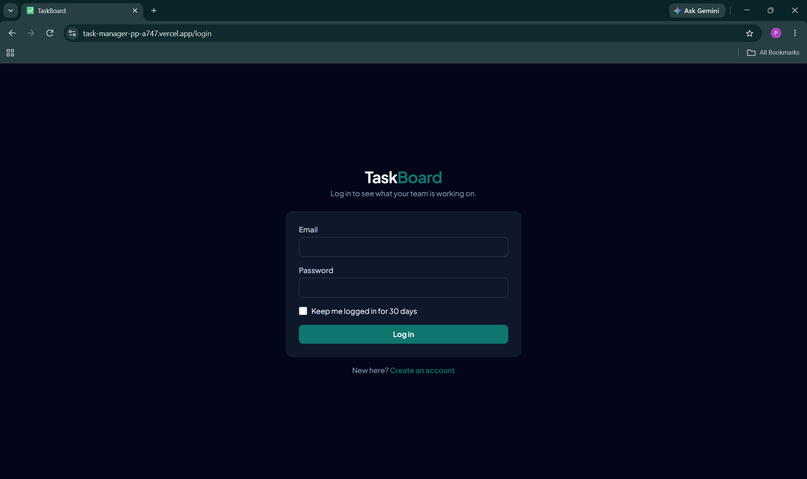
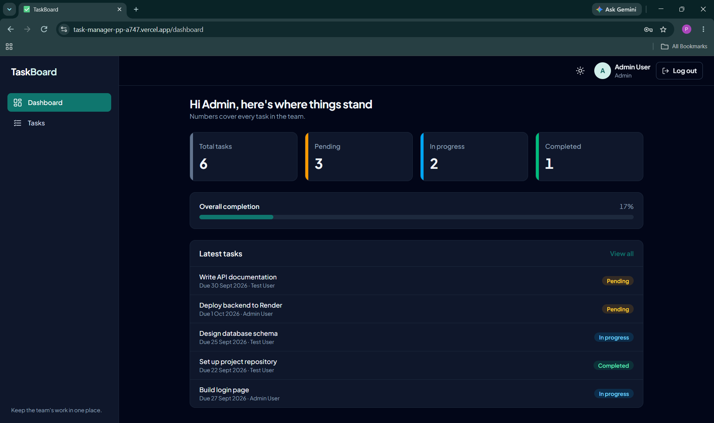
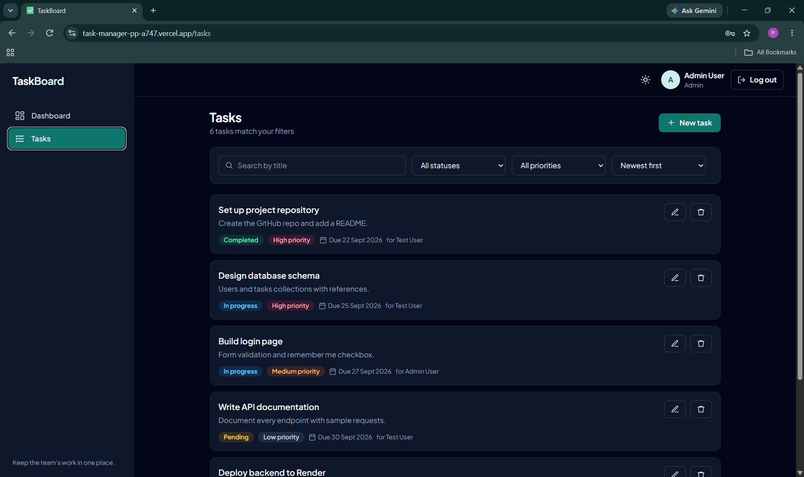
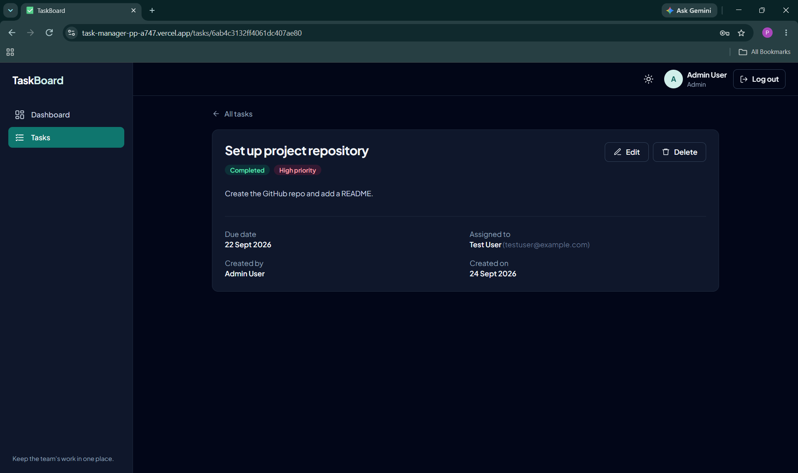
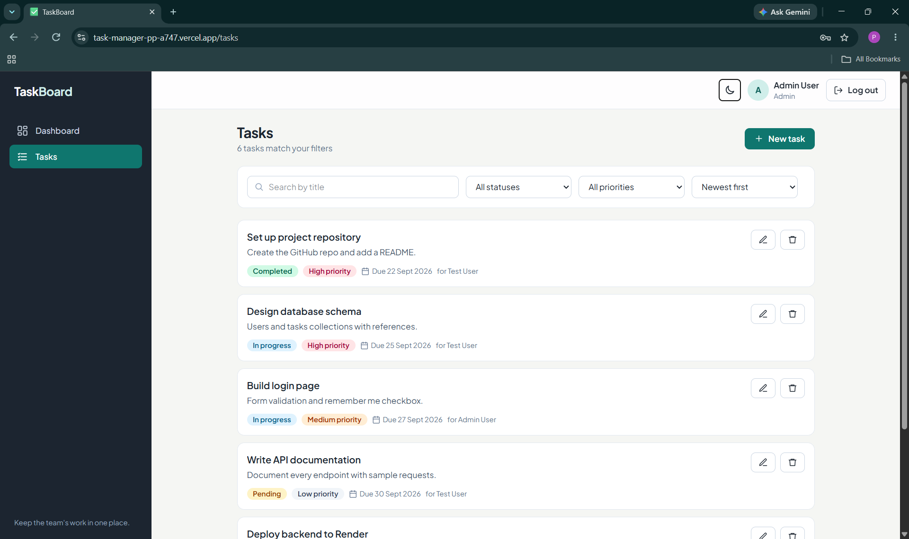
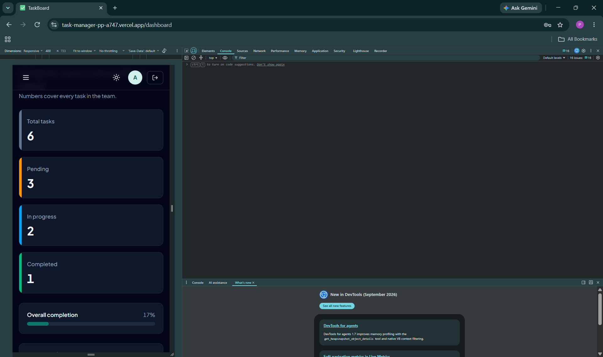

# TaskBoard: Task & Team Management Platform

A full-stack web app where a team can register, log in, and manage tasks: create them, assign them to people, filter and search, and track progress from a dashboard.

Built for the Full Stack Intern technical assessment.

## Live demo

| | URL |
|---|---|
| Frontend (Vercel) | `https://task-manager-pp-a747.vercel.app` |
| Backend (Render) | `https://task-manager-h6wu.onrender.com` |
| API health check | `https://task-manager-h6wu.onrender.com/` |

> The backend is on Render's free tier, so the first request after a quiet period can take 30-50 seconds while it wakes up.

## Test accounts (already seeded on the live site)

| Role | Email | Password |
|---|---|---|
| User | `testuser@example.com` | `Test@1234` |
| Admin | `admin@example.com` | `Admin@1234` |

## Screenshots

| Login | Dashboard |
|---|---|
|  |  |

| Tasks (filters + pagination) | Task details |
|---|---|
|  |  |

| Light mode | Mobile |
|---|---|
|  |  |

## Features

- Register, login, logout with JWT auth and bcrypt-hashed passwords
- "Keep me logged in" option (30 day token stored in localStorage, otherwise 1 day in sessionStorage)
- Protected routes on the frontend and JWT-protected endpoints on the backend
- Dashboard with Total / Pending / In progress / Completed cards and a completion bar
- Full task CRUD with title, description, priority, due date, status and assigned user
- Search by title, filter by status and priority, sort by date, server-side pagination
- Roles: admins can edit or delete any task; users can edit tasks they created or that are assigned to them, and delete tasks they created
- Friendly handling of 400, 401, 404 and network errors

**Bonus features (4 of the list):** dark mode, pagination, toast notifications, Docker.

## Tech stack

| Layer | Tools |
|---|---|
| Frontend | React 18, Vite, React Router 6, Axios, Redux Toolkit, Tailwind CSS 4 |
| Backend | Node.js, Express 4, Mongoose 8, jsonwebtoken, bcryptjs |
| Database | MongoDB Atlas |
| Deployment | Vercel (client), Render (server), Atlas (database) |

React concepts used: `useState`, `useEffect`, `useMemo`, `useCallback`, `React.memo`, custom hooks (`useDebounce`, `useTaskList`, `useUsers`, `useToast`, `useTheme`), Redux Toolkit (auth, tasks, toasts), Context API (theme), `React.lazy` + `Suspense` for every page.

## Folder structure

```
.
├── client/
│   └── src/
│       ├── components/   reusable UI (Sidebar, Navbar, TaskCard, TaskFormModal, ...)
│       ├── pages/        Login, Register, Dashboard, Tasks, TaskDetails, NotFound
│       ├── hooks/        useDebounce, useTaskList, useUsers, useToast, useTheme
│       ├── services/     axios instance + auth/task API calls
│       ├── store/        Redux slices + ThemeContext
│       └── utils/        validators, formatters, token storage
├── server/
│   ├── config/           MongoDB connection
│   ├── controllers/      authController, taskController
│   ├── middleware/       JWT protect, error handler
│   ├── models/           User, Task
│   ├── routes/           authRoutes, taskRoutes
│   └── utils/            validators, token generator, seed script
├── docs/screenshots/
├── docker-compose.yml
└── TaskBoard.postman_collection.json
```

## Running locally

You need Node 18+ and a MongoDB connection string (Atlas free tier, or local MongoDB / Docker).

**1. Backend**

```bash
cd server
npm install
cp .env.example .env     # then fill in MONGO_URI and JWT_SECRET
npm run seed             # creates the two test accounts + sample tasks
npm run dev              # http://localhost:5000
```

**2. Frontend**

```bash
cd client
npm install
cp .env.example .env     # VITE_API_URL=http://localhost:5000/api
npm run dev              # http://localhost:5173
```

**Docker option (API + Mongo):**

```bash
docker compose up --build
docker compose exec server npm run seed
```

### Environment variables

| File | Variable | Purpose |
|---|---|---|
| `server/.env` | `PORT` | API port (Render sets this itself) |
| | `MONGO_URI` | MongoDB Atlas connection string |
| | `JWT_SECRET` | Secret used to sign tokens |
| | `CLIENT_URL` | Allowed frontend origin(s) for CORS, comma separated |
| `client/.env` | `VITE_API_URL` | Backend base URL including `/api` |

## API documentation

Base URL: `https://YOUR-API.onrender.com/api`. All bodies are JSON. Send the token as `Authorization: Bearer <token>` on protected routes.

Errors always look like `{ "message": "..." }`.

### Auth

| Method | Endpoint | Auth | Purpose |
|---|---|---|---|
| POST | `/register` | no | Create an account |
| POST | `/login` | no | Log in and get a JWT |
| GET | `/me` | yes | Current user (used to validate a saved token) |
| GET | `/users` | yes | List users for the "assign to" dropdown |

**POST /register**

```json
// request
{ "name": "Asha Patil", "email": "asha@example.com", "password": "Strong@123" }

// 201 response
{ "token": "eyJhbGciOi...", "user": { "id": "66f...", "name": "Asha Patil", "email": "asha@example.com", "role": "user" } }
```

**POST /login**

```json
// request
{ "email": "testuser@example.com", "password": "Test@1234", "rememberMe": true }

// 200 response (same shape as register)
```

### Tasks (all need a token)

| Method | Endpoint | Purpose |
|---|---|---|
| GET | `/tasks` | List tasks (search, filter, sort, paginate) |
| GET | `/tasks/stats` | Counts for the dashboard cards |
| GET | `/tasks/:id` | Single task |
| POST | `/tasks` | Create a task |
| PUT | `/tasks/:id` | Update a task |
| DELETE | `/tasks/:id` | Delete a task |

**GET /tasks query params**

| Param | Values | Default |
|---|---|---|
| `search` | text matched against title (case-insensitive) | |
| `status` | `pending`, `in-progress`, `completed` | |
| `priority` | `low`, `medium`, `high` | |
| `sort` | `newest`, `oldest`, `dueAsc`, `dueDesc` | `newest` |
| `page` | number | `1` |
| `limit` | 1 to 50 | `10` |

```json
// 200 response
{
  "tasks": [
    {
      "_id": "66f...",
      "title": "Design database schema",
      "description": "Users and tasks collections with references.",
      "priority": "high",
      "status": "in-progress",
      "dueDate": "2026-09-25T00:00:00.000Z",
      "assignedTo": { "_id": "66f...", "name": "Test User", "email": "testuser@example.com" },
      "createdBy":  { "_id": "66f...", "name": "Admin User", "email": "admin@example.com" }
    }
  ],
  "total": 6, "page": 1, "pages": 1
}
```

**POST /tasks** body: `title`, `dueDate`, `assignedTo` (user id) are required; `description`, `priority`, `status` optional. Returns `201 { "task": {...} }`.

**PUT /tasks/:id** accepts any of `title`, `description`, `priority`, `status`, `dueDate`, `assignedTo`. Returns `{ "task": {...} }`.

**DELETE /tasks/:id** returns `{ "message": "Task deleted", "id": "..." }`.

**GET /tasks/stats**

```json
{ "total": 6, "pending": 3, "inProgress": 2, "completed": 1 }
```

### Status codes

| Code | When |
|---|---|
| 200 / 201 | Success / created |
| 400 | Missing or invalid fields, malformed id, bad filter value, invalid JSON |
| 401 | No token, invalid token, expired token, wrong login credentials |
| 403 | Logged in but not allowed to edit / delete that task |
| 404 | Task or route does not exist |
| 409 | Email already registered |
| 500 | Unexpected server error |

Network failures (server unreachable or timeout) are caught in the Axios interceptor and shown as a readable message in the UI.

## Database design

**User**: `name`, `email` (unique, lowercase), `password` (bcrypt hash, `select: false`), `role` (`user` | `admin`), timestamps.

**Task**: `title`, `description`, `priority`, `status`, `dueDate`, `assignedTo` (ref User), `createdBy` (ref User), timestamps. Indexed on `status + priority` and `title`.

## API collection

Import `TaskBoard.postman_collection.json` into Postman or Bruno. Set the `baseUrl` collection variable, run **Login** once and the token is saved automatically for the other requests.

## Deployment notes

1. **MongoDB Atlas**: create a free cluster, add a database user, allow `0.0.0.0/0` under Network Access, copy the connection string.
2. **Render** (Web Service): root directory `server`, build command `npm install`, start command `npm start`. Add `MONGO_URI`, `JWT_SECRET`, `CLIENT_URL` (your Vercel URL).
3. **Seed** the production database once: run `npm run seed` locally with the Atlas `MONGO_URI` in `.env`.
4. **Vercel**: root directory `client`, framework Vite. Add `VITE_API_URL=https://YOUR-API.onrender.com/api`. `vercel.json` already handles SPA refresh routing.
